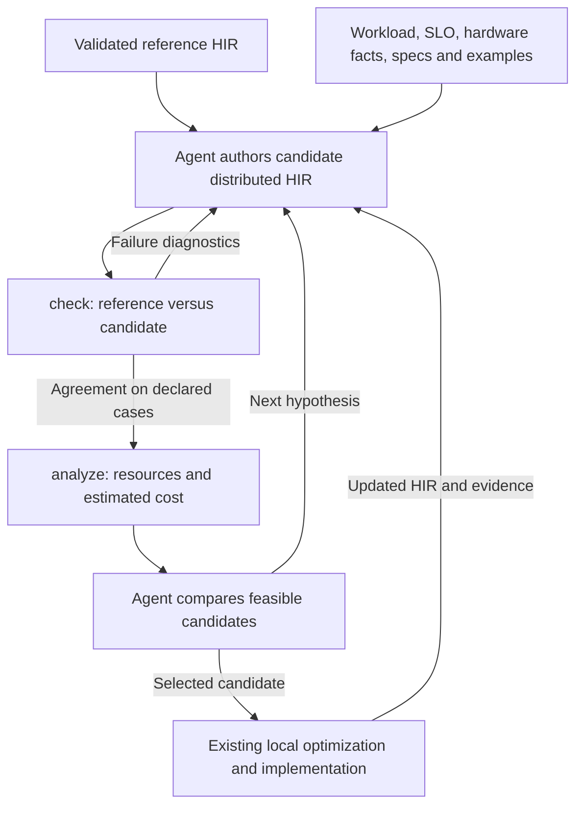

# RFC: Engine-scope optimization with distributed HIR

Status: Accepted for implementation. Device collectives, bounded MoE routing,
explicit reference-HIR checking, and the initial distributed resource model
are implemented. The executable engine tutorial demonstrates candidate
comparison under a supplied workload and deployment profile. Broader strategy
coverage and physical backend handoff remain on the roadmap.

## 1. Summary

Extend TileFoundry's agent workflow with an optimizer stage that transforms a
validated reference HIR into a distributed HIR and evaluates its resource and
performance costs. The objective is to maximize throughput under a supplied SLO
and hardware budget.

The optimizer has two substages: transformation and cost evaluation. The agent
authors transformations using specifications and examples; `check` validates
their numerical behavior, and `analyze` derives costs from the resulting HIR.
The agent uses those reports to revise or select a candidate before entering the
existing local optimization and runtime implementation workflow.

This design is independent of a particular model, accelerator, communication
library, or serving framework. Model sources, weights, hardware facts, workload
points, and SLO values are inputs to an optimization run.

The architectural acceptance criterion is:

> An agent can author a new legal composition of supported HIR operations,
> check its behavior, and analyze its costs without registering a transformation
> rule or writing a cost function for the composed kernel or strategy.

## 2. Motivation and current state

The [current workflow](../tutorial/index.md) first establishes a correct HIR
reference and then improves its implementation. Engine-level decisions add
another source of performance variation: which devices own weights, activations,
and persistent state; which computation they perform; and how they communicate.
These decisions also determine whether a workload fits in memory.

TileFoundry already provides useful foundations:

| Foundation | Current contract and gap |
| --- | --- |
| [HIR](../spec/hir.md) and [sharding](../spec/shard.md) | Functions, structured loops, meshes, layouts, and partial reductions describe computation and ownership. Distributed communication needs explicit semantics. |
| [Evaluator](../spec/evaluator.md) | Executes logical values on torch tensors. It does not currently simulate communication among mesh participants. |
| [`check`](../spec/cli.md#check) | Compares implementation outputs with reference results using caller-supplied predicates. Explicit reference-HIR versus candidate-HIR comparison needs a distributed execution path. |
| [Analysis](../spec/analysis.md) | Derives work, traffic, memory, and nominal timing from authored HIR. Distributed links, per-device persistent state, and communication scheduling need coverage. |
| [Target facts](../spec/target.md) | Describe capabilities and device resources. A deployment also needs concrete connectivity, device counts, and link resources. |
| Separately supplied parallelism examples | Explain distributed strategies using semantic pseudocode. Their workload constants and candidate mappings are examples, not universal optimizer constraints. |

Two existing boundaries require particular care. `Reshard` currently treats a
same-storage layout change as a view; this is not sufficient to express moving
data between devices. The existing `performance` analysis describes a nominal
local execution model; extending engine analysis must preserve the meaning of
its existing results.

## 3. Goals and scope

The initial scope includes tensor parallelism, expert parallelism, expert tensor
parallelism, data parallelism, and context parallelism for prefill and decode.
Their combinations are expressed through HIR ownership, computation, and
communication. Separate prefill and decode placements may exchange explicitly
represented persistent state.

The stage delivers a selected distributed HIR, its deployment mapping and state
contracts, and the evidence used to select it. The existing workflow then
implements and optimizes that program locally.

The following boundaries keep the work focused:

- The public workflow uses `check` and `analyze`; this RFC adds no `eval` command
  and no compiler-owned strategy-search command.
- Strategy documents and examples guide the agent. They do not enumerate the
  only permitted transformations.
- Cost analysis is compositional over supported HIR. Primitive operation models
  and hardware facts remain necessary; a handwritten cost model per composed
  kernel or parallel strategy is not required.
- Timing estimates support candidate ranking and approximate SLO filtering.
  Full serving-runtime simulation, queueing, admission control, continuous
  batching, and packet-level network simulation are outside the initial scope.
- Profiling and detailed kernel calibration are optional later refinements.
  They are not prerequisites for evaluating a candidate.
- Pipeline parallelism is deferred because it introduces additional scheduling
  and activation-lifetime decisions. It should later be expressed through an
  explicit execution model rather than treated as an ordinary tensor split.

## 4. Workflow and ownership

Transformation includes choosing placements, sharding, replication, algorithms,
and communication arrangements. Correctness checking is the acceptance gate for
a transformation. Cost evaluation measures the authored candidate and does not
silently rewrite it or select a strategy.

The agent owns candidate generation, workload sweeps, search budget, ranking,
and stopping. TileFoundry owns operation semantics, legality checks, numerical
evaluation, hardware facts, and reproducible analysis. Cheap legality or capacity
checks may reject a candidate before expensive numerical evaluation; promotion
still requires both correctness evidence and a resource/cost report.

Search produces the best feasible candidate found within its declared budget,
not a claim of global optimality. If no candidate meets the constraints, report
that outcome with the relevant bottlenecks instead of changing the workload or
silently relaxing the SLO.

## 5. Inputs and outputs

### 5.1 Optimization inputs

The following are conceptual records, not proposed Python classes or CLI syntax:

| Input | Required information |
| --- | --- |
| Reference program | HIR entry points, logical inputs and outputs, weight bindings, persistent-state transitions, numerical comparison policy, and source provenance. |
| Hardware deployment | Device capabilities, counts, memory capacities, compute and memory rates, connectivity, communication capabilities, and provenance of supplied facts. |
| Workload | Execution phase, total context, uncached token count, per-replica batch points, dtypes, initial state, and any data-dependent routing assumptions or bounds. |
| Objective | Throughput definition, latency budgets, hardware budget, required workload coverage, and any workload mixture weights. |
| Search configuration | Evaluation budget, candidate history, and permitted implementation capabilities. |

Workload dimensions have distinct meanings. For a contiguous reusable prefix,
`total_context = reusable_prefix + uncached_tokens`; the uncached count includes
all tokens that must be recomputed after cache lookup. Cached context still
affects attention reads and persistent storage. Recurrent state and other model
state are described by the program rather than inferred from a universal KV
formula.

Lengths, batch limits, hit rates, and SLO thresholds belong to workload profiles,
not compiler semantics or strategy documentation. Inconsistent profiles are
rejected. The physical deployment is supplied separately from instruction-set
capabilities: an architecture identifier alone does not establish available
memory, device count, or connectivity.

### 5.2 Optimization outputs

A selected candidate is delivered with:

- The authored distributed HIR and its relationship to the reference.
- Device/group mapping and input, weight, output, and persistent-state layouts.
- The supported workload domain and selected batch points.
- Correctness reports with the cases, predicates, and bounds actually checked.
- Analysis reports with capacity, traffic, communication, timing assumptions,
  and the reasons for selection.
- Source, workload, and hardware identities sufficient to reproduce the result.

A deployment manifest may reference HIR definitions and supply physical rank
mapping. It must not become a second, independently editable definition of
tensor ownership or communication semantics.

## 6. Distributed HIR

### 6.1 One authored program

Distributed HIR remains ordinary HIR extended with the necessary primitives.
Global tensor shapes state logical meaning; layouts and meshes state ownership.
Programs for individual ranks are downstream execution or lowering products.
Analysis may construct an internal event graph, but it remains a derived view of
the authored HIR rather than another source language.

Device-level distribution and finer execution levels remain distinguishable.
The same physical devices may have different logical group views for different
subgraphs. There is no universal requirement that parallel degrees multiply
together or that an expert group equal a particular attention group.

### 6.2 Communication semantics

The initial primitive coverage needs broadcast, gather, scatter, all-gather,
reduction, all-reduce, reduce-scatter, and fixed or variable-size all-to-all.
Some may be expressible as compositions; the owner specs will settle the minimal
primitive set. These names identify required semantics, not existing DSL calls.

Each communication operation defines:

- Participants and their rank order or coordinate mapping.
- Payload shapes, dtypes, source and destination ownership, and reduction kind
  where applicable.
- Value dependencies and ordering relative to other communication in the same
  group, including participation by ranks with no payload.
- Counts, offsets, padding, and capacity bounds for variable-size exchanges.
- Reference evaluation, access/traffic relations, legality, and requirements on
  a downstream implementation.

Cross-device movement is explicit. A layout annotation alone cannot cause an
unreported transfer or convert a partial value into a complete value. Existing
`Reshard` behavior remains unchanged initially; a future redistribution shorthand
would need to elaborate into explicit communication with the same checks and
cost accounting.

Collectives must have a consistent ordering across participating ranks. The
semantic design must specify how that ordering survives HIR traversal and later
rewrites. This can use explicit dependencies or an ordering representation; the
choice must be settled before collective implementation.

### 6.3 Persistent and data-dependent state

State remains explicit in function inputs and outputs. Examples include cache
append, recurrent-state replacement, and bounded convolution windows. Prefix
reuse supplies the state associated with the reused prefix boundary. If
prefill and decode use different layouts, their boundary includes a state-layout
conversion whose semantics, temporary storage, and traffic are visible.

Expert dispatch preserves token identity, routing weights, and the information
needed to restore output order. Numerical evaluation uses actual counts.
Analysis uses declared counts, ranges, or workload assumptions and identifies
which results depend on them. Balanced routing may be a timing assumption, but
it cannot silently stand in for a capacity bound.

Context-parallel examples must express the algorithm's actual dependency. For
softmax attention this includes normalization-aware combination of partial
results; for recurrent algorithms it includes propagation or composition of
state across token partitions. These are executable HIR examples assembled from
supported operations, not strategy names with hidden implementations.

## 7. Correctness through `check`

Extend `check` to accept an explicit reference HIR and candidate HIR while
preserving existing runtime-twin and expected-output workflows. Both sides use
the same logical activations, weights, dimensions, and initial state. Reference
selection and input binding are part of the report. Exact argument spelling is
left to the CLI contract work.

The internal evaluator gains a mode that simulates logical ranks and their local
tensors on one physical device. It executes local computation and collective
semantics and reconstructs the declared observable outputs. It must not replace
the candidate with the original logical computation or repair a missing
collective implicitly.

Comparison includes persistent-state outputs and repeated invocations that
consume them. Different physical layouts are compared through their declared
logical correspondence. A different state representation requires an explicit,
checkable reconstruction contract. Evaluator-only gathering for comparison is
not charged as deployed communication unless it is also part of the candidate.

Numerical predicates and tolerances remain caller-supplied. Integral routing and
index results use appropriate exact checks. A passing report states agreement
on the supplied cases; it is not a proof for every possible input. Shape,
placement, and collective legality checks complement numerical evaluation.

Correctness cases may use smaller concrete sizes to exercise partition
boundaries, empty routes, padding, and state transitions. Cost analysis still
uses the declared production workload sizes. Reports distinguish these domains;
an unsupported or unexecuted case never becomes a correctness pass.

Semantic simulation does not validate a communication library or establish that
physical execution is deadlock-free. That remains part of validating the runtime
implementation in the downstream workflow.

## 8. Compositional cost evaluation through `analyze`

### 8.1 Derive costs from the candidate

Extend the existing analysis machinery over the same typed HIR. Primitive
operation semantics and access relations determine work and data movement;
layouts determine local ownership and replication; target facts supply rates
and capacities. Loops and function composition aggregate those quantities.

A new composition of supported primitives requires no kernel-specific cost
registration. A genuinely new primitive requires its semantic, access, and
analysis contracts. Unsupported operations or missing required facts produce
diagnostics or an explicitly incomplete report, never an implicit zero cost.

Representative algorithm HIRs expose the implementation choices relevant to
strategy ranking: tiled attention, online normalization, quantization and
scales, cache writes, sparse reads, routing, and communication. Their names do
not select opaque cost formulas. Tiling, fusion, or replication changes costs
because the authored storage and accesses change.

Inlining or summarization must avoid charging both a function and its expanded
body. Any execution boundary relevant to costing must be explicit or derived
from documented semantics; an arbitrary helper-function boundary does not imply
a device launch. Structured loops should remain analyzable without materializing
one graph node per token or iteration.

### 8.2 Memory feasibility

For each device and declared execution schedule, estimate the peak simultaneous
allocation of resident weights, persistent state, live intermediates, and
communication/workspace buffers, then include the declared runtime reserve.
Persistent state remains live across the invocations that require it.

Capacity and traffic are separate quantities. All resident expert weights count
toward capacity even when an invocation reads only a subset. Retaining a cache
does not mean every operation reads all of it. Shared storage, aliasing, in-place
updates, and reused prefixes reduce capacity only when their ownership and
lifetimes justify that reduction. The evaluator's temporary torch allocations
are not the candidate's physical memory model.

Variable-size operations need a stated allocation bound or capacity policy.
Unknown bounds leave capacity unresolved. Fragmentation, reserved memory, and
optional state snapshots are explicit deployment/workload inputs rather than
hidden constants. State transfer includes temporary source and destination
storage where both are live.

The report distinguishes a conservative capacity result from an estimate that
depends on an assumed allocation schedule. An optimistic footprint alone cannot
establish feasibility.

### 8.3 Communication and timing

Communication costs derive from explicit payloads, participants, and topology.
A generic latency-plus-transfer model is sufficient initially. Link bandwidth,
startup latency, routes, and shared resources come from attributed target or
deployment facts. Communication-buffer reads and writes are accounted for
consistently with network transfers, avoiding both omissions and duplicate
charges for the same access.

Compose primitive costs over data and communication dependencies with a simple,
documented resource model. The initial schedule can serialize work sharing a
resource and permit overlap where dependencies and resource independence allow
it. Refining contention or overlap later should preserve the reported model
identity. Summing all devices' work is not a substitute for estimating the
critical path.

The existing local `performance` result keeps its current meaning. Distributed
timing is exposed through clearly identified records within `analyze`, with the
schema and selector details settled in the analysis contract. Optional
ideal-overlap results are labeled bounds and remain separate from the estimate
for the authored execution structure.

The report states what latency includes. Prefill execution time can be compared
with an allocated TTFT budget, but it does not implicitly include request
queueing or unmodeled service overhead. Decode step time, average time per
emitted token, and inter-output latency remain distinct when one invocation can
emit multiple tokens. Any conversion uses explicit output/acceptance assumptions.

### 8.4 Report requirements

Reports should expose enough evidence for an agent to form its next hypothesis:

- Work and traffic by operation, execution scope, and device.
- Resident state and peak allocations, including the limiting device and live
  buffers at a capacity failure.
- Communication bytes and estimated time by group and topology resource.
- Estimated critical path and compute, memory, or communication bottlenecks.
- Workload bindings, hardware provenance, modeling assumptions, and unsupported
  or unresolved quantities.

Human-readable and machine-readable reports come from the same analysis
results. Findings retain source/operation provenance so the agent can identify
the HIR responsible for a bottleneck.

## 9. Search, examples, and handoff

The agent uses specification and example documents to propose transformations.
Examples describe preconditions, logical behavior, state handling, and expected
resource tradeoffs, and include runnable HIR. They remain starting points for
composition rather than a whitelist of legal strategies.

Candidate comparison maximizes the workload's throughput measure subject to
correctness, supported implementation capabilities, capacity, and approximate
latency constraints. Batch sweeps report the feasible region; a candidate that
fails at a larger batch can remain useful at smaller batches. Pruning larger
points after a failure requires a justified monotonicity assumption.

Keep a small Pareto frontier when throughput and latency trade off. For multiple
workload classes, either use an explicitly supplied mixture/objective or report
separate frontiers. An average must not hide a required workload's SLO failure.
The report identifies every comparison's device budget and work completed, so
replication or speculative work cannot inflate useful throughput.

The initial policy selects a strategy per declared execution phase or pool.
If a candidate switches layouts during a stateful request, the transition must
appear in its program and cost. Reference semantics, numerical policy, workload,
hardware facts, and analysis assumptions remain fixed when comparing candidates.

The selected HIR enters the existing local optimization workflow with its
communication and state contracts intact. Later changes to layout, buffering,
or computation require renewed checking and analysis. Measured results can
motivate another agent iteration without making measurement a prerequisite for
the engine-stage search.

## 10. What to do next

The following phases are an implementation roadmap. Exact APIs and source diffs
belong in subsequent implementation plans. Each phase should update its owning
specifications together with the corresponding implementation.

Implemented checkpoints cover distributed correctness and the first engine
cost model: `analyze --engine --engine-profile PATH` reports rank ownership,
resident/peak HBM, communication, a declared resource schedule and estimated
throughput under an invocation budget. The model preserves local-analysis
semantics and reports missing facts and routing assumptions explicitly.
The [engine tutorial](../tutorial/engine-analysis.md) executes a small
check–analyze–select comparison; it does not complete the physical runtime
handoff required below.

Remaining work includes richer placement/communication algorithms, attention
and recurrent context-parallel examples, quantization/cache-update examples at
engine scope, local-resource integration, and an executable physical backend
realization of a selected strategy. The initial engine model uses conservative
out-of-place buffers and does not infer in-place state reuse.

### Phase 1: Settle distributed semantic contracts

Deliver the participant/group representation, global/local shape rules, partial
reduction transitions, collective ordering, variable-size payload representation,
and persistent-state boundary. Define portable workload and deployment inputs.
Resolve the open interface questions in Section 12 before implementing affected
surfaces.

Acceptance: small model-independent HIR examples can state a projection split,
a context/state split, and token dispatch/combine without opaque strategy nodes.
Their communication, state correspondence, and required capabilities are explicit.

Related files: [architecture](../spec/architecture.md), [HIR](../spec/hir.md),
[sharding](../spec/shard.md), [types](../spec/types.md),
[parser](../spec/parser.md), and [target](../spec/target.md).

### Phase 2: Enable distributed correctness checking

Implement collective primitives and their type/layout checks, the rank-simulating
evaluator, and explicit reference-versus-candidate selection through `check`.
Preserve existing command behavior and numerical comparison policy.

Acceptance: reference and candidate agree for representative partitioned
computation and repeated state transitions; deliberately missing reductions,
incorrect routing, or incompatible groups are detected. Cover externally
reachable empty-route and uneven-partition cases where the contract supports
them. Reuse existing evaluator and command workflows where possible.

Related files: `src/tilefoundry/ir/hir/`, `src/tilefoundry/evaluator/`,
`src/tilefoundry/cli/check.py`, [HIR](../spec/hir.md),
[evaluator](../spec/evaluator.md), and [CLI](../spec/cli.md).

### Phase 3: Add distributed resource and cost analysis

Extend primitive access/cost analysis, deployment facts, per-device memory
ownership, communication accounting, and dependency-based timing. Add report
records and diagnostics without changing the meaning of existing local results.

Acceptance: analytically tractable examples establish correct byte ownership,
resident-versus-read distinctions, communication payloads, and limiting-device
capacity. Changing an input deployment's capacity or link rate affects the
appropriate result. Unknown facts are reported. New compositions of supported
operations work without a composed-kernel cost registration.

Related files: `src/tilefoundry/analysis/`, `src/tilefoundry/visitor_registry/`,
`src/tilefoundry/target/`, `src/tilefoundry/inspection/`,
`src/tilefoundry/cli/analyze.py`, [analysis](../spec/analysis.md),
[target](../spec/target.md), [inspection](../spec/inspection.md), and
[CLI](../spec/cli.md).

### Phase 4: Publish specifications and executable examples for agents

Provide portable HIR examples for tensor and expert parallelism, prefill/decode
context partitioning, recurrent-state handling, and their useful combinations.
Include representative attention, routing, quantization, and cache-update
algorithms as analyzable HIR. Expose the material through the existing installed
documentation/example discovery surfaces.

Acceptance: examples use public supported operations, pass `check`, and produce
cost reports. An agent can alter a composition and receive useful feedback from
the same commands. Deployment and workload values are supplied externally.

Related files: `parallelism/`, `docs/tutorial/`, `tests/fixtures/`,
`src/tilefoundry/cli/`, [CLI](../spec/cli.md), and package-data configuration.

### Phase 5: Demonstrate the optimizer workflow and downstream handoff

Run an agent-guided search with separately supplied reference, workload, and
deployment profiles. Retain candidate HIRs, correctness results, cost reports,
and the selected frontier. Demonstrate the selected program entering the
existing implementation workflow with its state and communication contracts.

Acceptance: the search reproduces its selection under fixed inputs, reports
infeasible cases, and delivers a reviewable HIR. At least one candidate combines
supported primitives in a way that needs neither a new transformation rule nor
a new composed-kernel cost function. A small executable realization validates
the handoff; broad kernel tuning and serving benchmarks remain downstream work.

Related files: `docs/tutorial/`, portable workflow examples, and the existing
integration/runtime workflows used for the realization.

## 11. Validation strategy

Use focused, reusable behavioral coverage for new semantics. The key evidence
is numerical agreement across distribution and state transitions, correct
resource accounting on small independently calculable programs, and preservation
of existing command behavior. Tests should exercise plausible failures at public
boundaries rather than assert source shape or a particular internal design.

Large workload points primarily exercise analysis scalability and resource
feasibility; they need not all materialize full tensors in the reference
interpreter. Report this distinction explicitly. Runtime validation verifies the
implementation of a selected HIR and its collectives; analytical predictions
remain predictions until measured.

The RFC is complete as a design proposal when the workflow boundaries, semantic
requirements, ownership, roadmap, and acceptance evidence are reviewable.
Implementation completion requires the phase-specific evidence above.

## 12. Open design questions

These are generic implementation decisions, independent of the first model or
hardware deployment:

1. What is the smallest collective primitive set, and how are ordering and
   participant groups represented without compromising existing HIR value
   semantics?
2. Which representation best expresses variable-size token exchanges and their
   capacity bounds within the current type and symbolic-dimension system?
3. How should `check` name the second HIR and bind logical state or explicit
   reconstruction adapters while preserving its existing input conventions?
4. How should deployment connectivity extend target facts, and which analysis
   record/schema changes expose distributed timing and capacity assumptions?
5. How should workload profiles and candidate reports be serialized and exposed
   through the existing command surfaces?

The initial answers should favor the smallest coherent extensions to existing
owners. They do not reopen the decisions to use agent-authored transformations,
`check` for correctness, and compositional `analyze` for cost evaluation.

## 13. Related work

[RoofLang](https://arxiv.org/pdf/2609.12551v1) combines graph transformations,
placement, and analytical simulation to guide architecture search. It provides
useful examples of communication simplification, memory/traffic separation, and
cost-based exploration. Its [implementation](https://github.com/yzygitzh/rooflang)
uses explicit transformation helpers and kernel-level analytical descriptions.

This proposal retains TileFoundry's executable HIR as the common foundation:
the agent authors transformations from specs and examples, the evaluator checks
their behavior, and analysis derives costs from their supported primitive
composition. The initial cost model aims to expose architectural tradeoffs with
declared assumptions rather than reproduce a particular serving stack.
